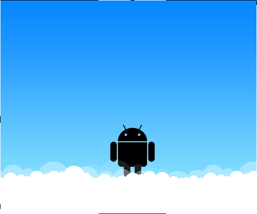
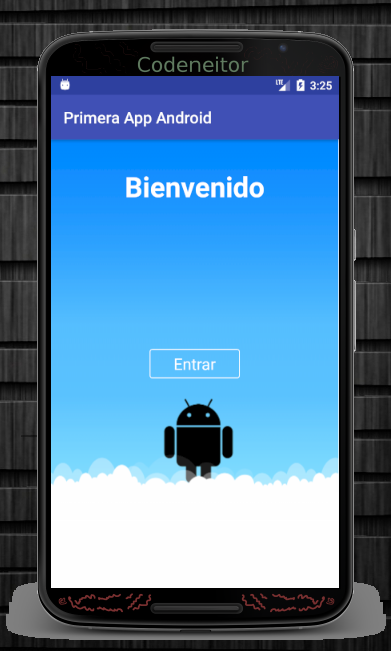
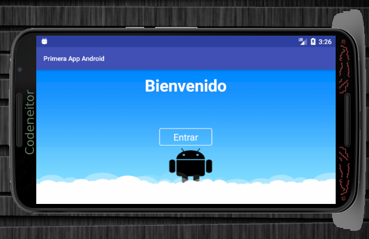

# Trabajo realizado en la semana 3.

## Se generó el archivo nine patch a partir de la imagen proporcionada.

Se redujo el tamaño de la imagen debido a la pantalla del ordenador, la cual por su tamaño no permite la correcta manipulación de la imagen original.

 * Aplicación en Portrait

 * Aplicación en Landscape

