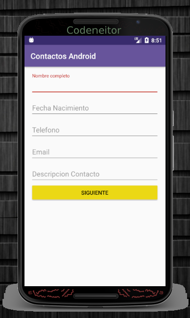
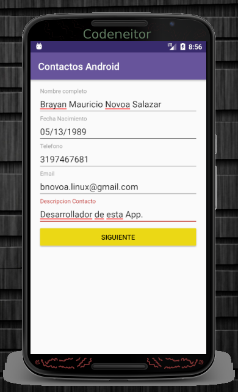
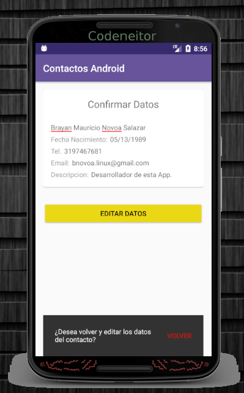
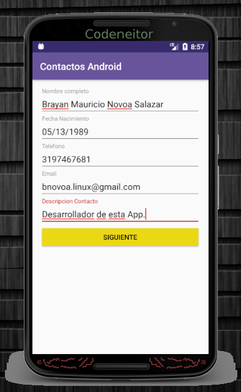

# Trabajo realizado en la semana 2.

Formulario de contacto donde se solicita al usuario los siguientes datos:

* Nombre completo
* Fecha de nacimiento
* Teléfono
* Email
* Descripción del contacto 

Formulario Completo utilizando el elemento EditText de Material Design.

Pantalla de confirmación de datos:

Se agrega un Snackbar para confirmar volver a editar los datos del contacto.

Formulario completo después de haber vuelto de la pantalla de confirmación de datos.

